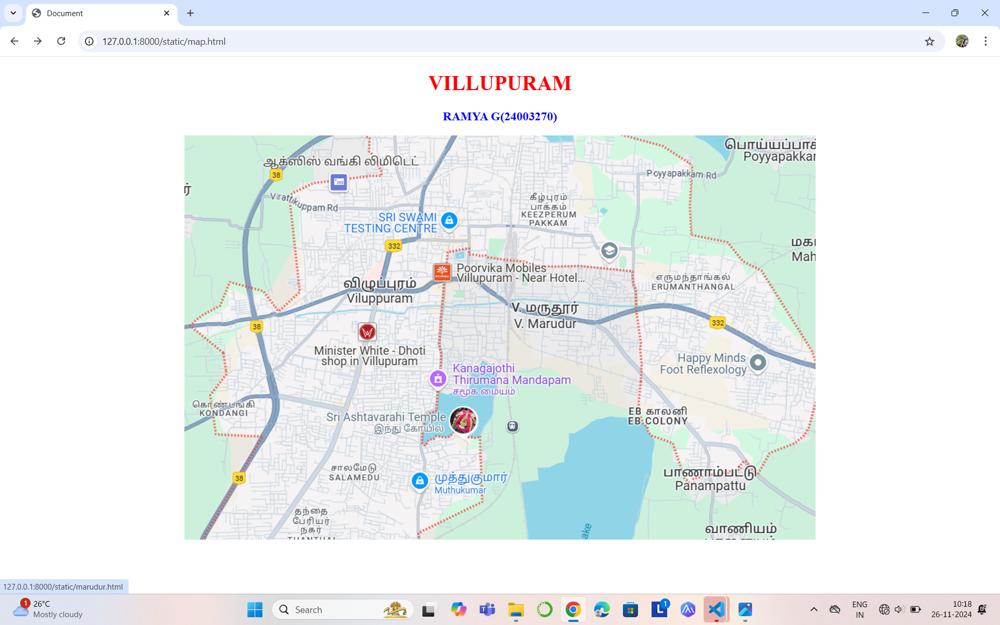
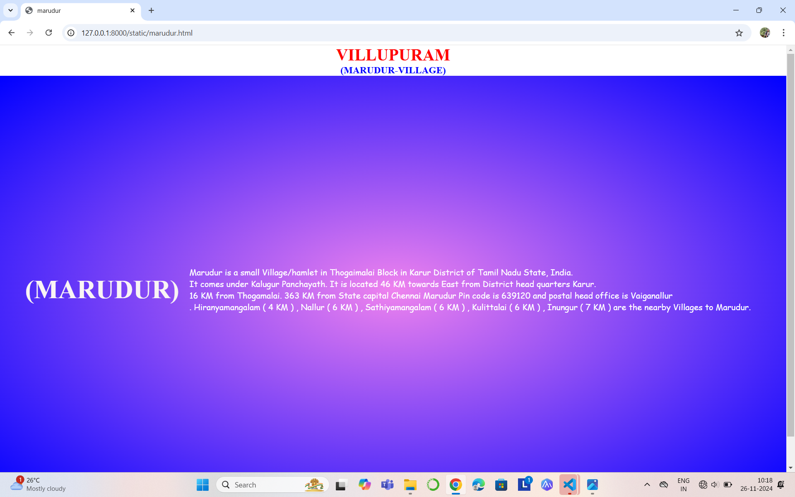
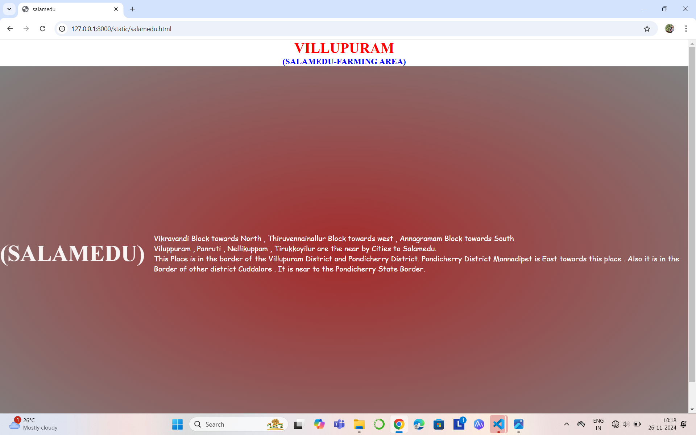
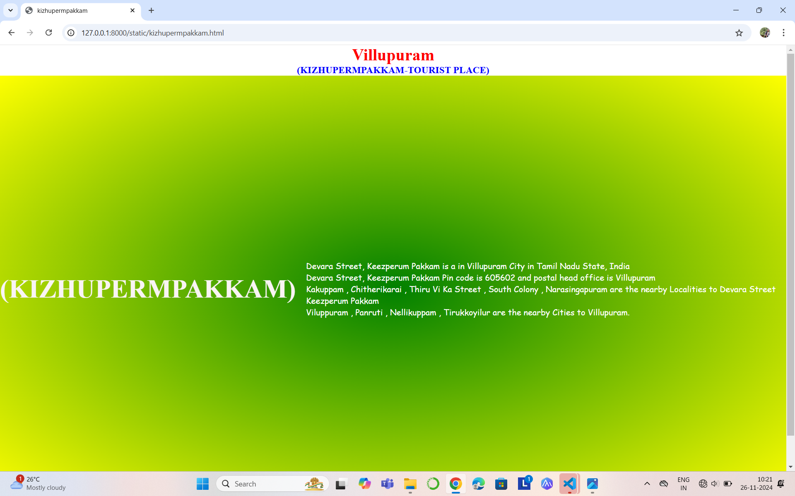
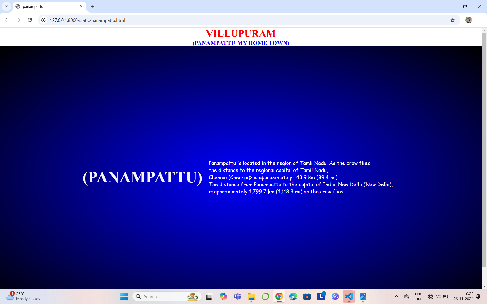
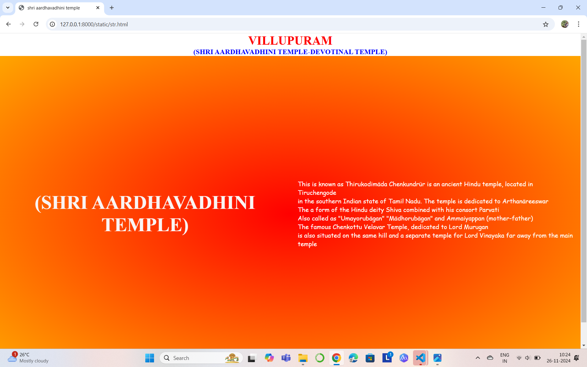

# Ex04 Places Around Me
## Date: 24/11/2024

## AIM
To develop a website to display details about the places around my house.

## DESIGN STEPS

### STEP 1
Create a Django admin interface.

### STEP 2
Download your city map from Google.

### STEP 3
Using ```<map>``` tag name the map.

### STEP 4
Create clickable regions in the image using ```<area>``` tag.

### STEP 5
Write HTML programs for all the regions identified.

### STEP 6
Execute the programs and publish them.

## CODE
```
google map.html

<!DOCTYPE html>
<html lang="en">
<head>
    <meta charset="UTF-8">
    <meta name="viewport" content="width=device-width, initial-scale=1.0">
    <title>Document</title>
</head>
<body align="center">
    <h1 align="center">
        <font color="red">
            <b>VILLUPURAM</b>
        </font>
    </h1>
    <h3 align= "center">
        <font color="blue">
            <b>RAMYA G(24003270)</b>
        </font>
    </h3>
    <div class="container">
        <div class="container">
            <!-- Image Map Generated by http://www.image-map.net/ -->
            
            
            <map name="image-map">
                <area target="" alt="panampattu" title="panampattu" href="panampattu.html" coords="729,504,888,548" shape="rect">
                <area target="" alt="salamedu" title="salamedu" href="salamedu.html" coords="210,500,310,536" shape="rect">
                <area target="" alt="kizhupermpakkam" title="kizhupermpakkam" href="kizhupermpakkam.html" coords="510,84,615,142" shape="rect">
                <area target="" alt="sriashtavarahittemple" title="sriashtavarahittemple" href="str.html" coords="210,411,455,468" shape="rect">
                <area target="" alt="marudur" title="marudur" href="marudur.html" coords="493,247,614,300" shape="rect">
            </map>
        </div>
    </div>
</body>
</html>

marudur.html

<!DOCTYPE html>
<html lang="en">
<head>
    <meta charset="UTF-8">
    <meta name="viewport" content="width=device-width, initial-scale=1.0">
    <title>marudur</title>
    <style>
        *{
            margin: 0;
            padding: 0;
        }
        .full{
            background: radial-gradient(violet,blue);
            background-size: cover  ;
            background-position: center;
            height: 100vh;
            display: flex;
            justify-content: center;
            align-items: center;
            color: #fff;
}
        
        .head{
            text-align: center;
            font-size: 50px;
            color: rgb(249, 244, 244);
        }
        .content{
            padding: 20px;
            font-family: cursive;
            font-size: medium;
        }
    </style>
</head>
<body>
    <h1 align="center">
        <font color="red">
            <b>VILLUPURAM</b>
        </font>
    </h1>
    <h3 align= "center">
        <font color="blue">
            <b>(MARUDUR-VILLAGE)</b>
        </font>
    </h3>
    <div class="full">
        <div class="head">
        <b>(MARUDUR)</b>
        </div>
        <div class="content">
            <p>Marudur is a small Village/hamlet in Thogaimalai Block in Karur District of Tamil Nadu State, India.<br>
                 It comes under Kalugur Panchayath. It is located 46 KM towards East from District head quarters Karur.<br>
                 16 KM from Thogamalai. 363 KM from State capital Chennai Marudur Pin code is 639120 and postal head office is Vaiganallur<br> .
              Hiranyamangalam ( 4 KM ) , Nallur ( 6 KM ) , Sathiyamangalam ( 6 KM ) , Kulittalai ( 6 KM ) , Inungur ( 7 KM ) are the nearby Villages to Marudur.
        </div>
    </div>
</body>
</html>

str.html

<!DOCTYPE html>
<html lang="en">
<head>
    <meta charset="UTF-8">
    <meta name="viewport" content="width=device-width, initial-scale=1.0">
    <title>shri aardhavadhini temple</title>
    <style>
        *{
            margin: 0;
            padding: 0;
        }
        .full{
            background: radial-gradient(red,orange);
            background-size: cover  ;
            background-position: center;
            height: 100vh;
            display: flex;
            justify-content: center;
            align-items: center;
            color: #fff;
}
        
        .head{
            text-align: center;
            font-size: 50px;
            color: rgb(249, 244, 244);
        }
        .content{
            padding: 20px;
            font-family: cursive;
            font-size: medium;
        }
    </style>
</head>
<body>
    <h1 align="center">
        <font color="red">
            <b>VILLUPURAM</b>
        </font>
    </h1>
    <h3 align= "center">
        <font color="blue">
            <b>(SHRI AARDHAVADHINI TEMPLE-DEVOTINAL TEMPLE)</b>
        </font>
    </h3>
    <div class="full">
        <div class="head">
        <b>(SHRI AARDHAVADHINI TEMPLE)</b>
        </div>
        <div class="content">
            <p> This is known as Thirukodimāda Chenkundrūr  is an ancient Hindu temple, located in Tiruchengode <br>
            in the southern Indian state of Tamil Nadu. The temple is dedicated to Arthanāreeswar<br>
            The a form of the Hindu deity Shiva combined with his consort Parvati<br>
            Also called as "Umayorubāgan" "Mādhorubāgan" and Ammaiyappan (mother-father)<br>
                   The famous Chenkottu Velavar Temple, dedicated to Lord Murugan<br>
                   is also situated on the same hill and a separate temple for Lord Vinayaka far away from the main temple
                </p>
        </div>
    </div>
</body>
</html>

kizhupermpakkam.html

<!DOCTYPE html>
<html lang="en">
<head>
    <meta charset="UTF-8">
    <meta name="viewport" content="width=device-width, initial-scale=1.0">
    <title>kizhupermpakkam</title>
    <style>
        *{
            margin: 0;
            padding: 0;
        }
        .full{
            background: radial-gradient(green,yellow);
            background-size: cover  ;
            background-position: center;
            height: 100vh;
            display: flex;
            justify-content: center;
            align-items: center;
            color: #fff;
}
        
        .head{
            text-align: center;
            font-size: 50px;
            color: rgb(249, 244, 244);
        }
        .content{
            padding: 20px;
            font-family: cursive;
            font-size: medium;
        }
    </style>
</head>
<body>
    <h1 align="center">
        <font color="red">
            <b>Villupuram</b>
        </font>
    </h1>
    <h3 align= "center">
        <font color="blue">
            <b>(KIZHUPERMPAKKAM-TOURIST PLACE)</b>
        </font>
    </h3>
    <div class="full">
        <div class="head">
        <b>(KIZHUPERMPAKKAM)</b>
        </div>
        <div class="content">
            <p>Devara Street, Keezperum Pakkam is a in Villupuram City in Tamil Nadu State, India<br>
                Devara Street, Keezperum Pakkam Pin code is 605602 and postal head office is Villupuram<br>
                Kakuppam , Chitherikarai , Thiru Vi Ka Street , South Colony , Narasingapuram are the nearby Localities to Devara Street Keezperum Pakkam<br>
                Viluppuram , Panruti , Nellikuppam , Tirukkoyilur are the nearby Cities to Villupuram.
        </div>
    </div>
</body>
</html>

salamedu.html

<!DOCTYPE html>
<html lang="en">
<head>
    <meta charset="UTF-8">
    <meta name="viewport" content="width=device-width, initial-scale=1.0">
    <title>salamedu</title>
    <style>
        *{
            margin: 0;
            padding: 0;
        }
        .full{
            background: radial-gradient(brown,grey);
            background-size: cover  ;
            background-position: center;
            height: 100vh;
            display: flex;
            justify-content: center;
            align-items: center;
            color: #fff;
}
        
        .head{
            text-align: center;
            font-size: 50px;
            color: rgb(249, 244, 244);
        }
        .content{
            padding: 20px;
            font-family: cursive;
            font-size: medium;
        }
    </style>
</head>
<body>
    <h1 align="center">
        <font color="red">
            <b>VILLUPURAM</b>
        </font>
    </h1>
    <h3 align= "center">
        <font color="blue">
            <b>(SALAMEDU-FARMING AREA)</b>
        </font>
    </h3>
    <div class="full">
        <div class="head">
        <b>(SALAMEDU)</b>
        </div>
        <div class="content">
            <p Salamedu is surrounded by Villupuram Block towards North <br>
            Vikravandi Block towards North , Thiruvennainallur Block towards west , Annagramam Block towards South<br>
            Viluppuram , Panruti , Nellikuppam , Tirukkoyilur are the near by Cities to Salamedu.<br>
             This Place is in the border of the Villupuram District and Pondicherry District. Pondicherry District Mannadipet is East towards this place . Also it is in the Border of other district Cuddalore . It is near to the Pondicherry State Border.
        </div>
    </div>
</body>
</html>

panampattu.html

<!DOCTYPE html>
<html lang="en">
<head>
    <meta charset="UTF-8">
    <meta name="viewport" content="width=device-width, initial-scale=1.0">
    <title>panampattu</title>
    <style>
        *{
            margin: 0;
            padding: 0;
        }
        .full{
            background: radial-gradient(blue,black);
            background-size: cover  ;
            background-position: center;
            height: 100vh;
            display: flex;
            justify-content: center;
            align-items: center;
            color: #fff;
}
        
        .head{
            text-align: center;
            font-size: 50px;
            color: rgb(249, 244, 244);
        }
        .content{
            padding: 20px;
            font-family: cursive;
            font-size: medium;
        }
    </style>
</head>
<body>
    <h1 align="center">
        <font color="red">
            <b>VILLUPURAM</b>
        </font>
    </h1>
    <h3 align= "center">
        <font color="blue">
            <b>(PANAMPATTU-MY HOME TOWN)</b>
        </font>
    </h3>
    <div class="full">
        <div class="head">
        <b>(PANAMPATTU)</b>
        </div>
        <div class="content">
            <p>Panampattu is located in the region of Tamil Nadu. As the crow flies<br>
                 the distance to the regional capital of Tamil Nadu,<br>
                  Chennai (Chennai)> is approximately 143.9 km (89.4 mi).<br> 
                  The distance from Panampattu to the capital of India, New Delhi (New Delhi),<br>
                   is approximately 1,799.7 km (1,118.3 mi) as the crow flies.</p>
        </div>
    </div>
</body>
</html>
```


## OUTPUT








## RESULT
The program for implementing image maps using HTML is executed successfully.
